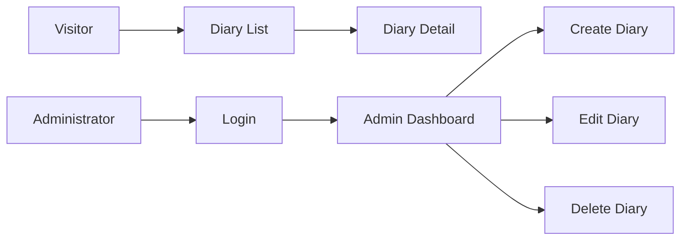

diary

# Daybook

Daybook is a full-stack diary application built with a Hono + TypeScript backend and a Next.js +
React frontend. The repository also includes product requirements, technical specifications, and
agent-oriented review guidance for development workflows.

## Demo

The repository does not include a screen recording yet, but the core user flow is designed around
the following experience:



## Features

- Public diary browsing with list and detail views
- Administrator-only create, edit, and delete flows
- Japanese / English i18n-ready UI design
- Requirements and specification documents under `docs/`
- Agent-based review workflow using `.github/agents/` and `agents/`

## Requirements

- Bun
- Node.js
- TypeScript
- Hono `4.12.23`
- Next.js `16.2.6`
- React `19.2.4`
- next-intl `4.13.0`
- Drizzle ORM `0.45.2`

## Installation

Install dependencies for both the backend and frontend:

```bash
git clone <repository-url>
cd diary/backend
bun install
cd ../frontend
bun install
```

## Usage

Start the backend and frontend in separate terminals:

```bash
# Terminal 1
cd backend
bun run dev

# Terminal 2
cd frontend
bun run dev
```

Then open the frontend in your browser, typically at `http://localhost:3000`.

## Note

- Product and technical documents are stored under `docs/`.
- Review-specific guidance is stored under `agents/` and is read by
  `.github/agents/CodeReviewAgent.agent.md`.
- Add a demo video, screenshots, or architecture diagrams if the repository is going to be shared
  more broadly.

## Author

- kishimin

## License

No `LICENSE` file is currently included in this repository. Define the license or internal
distribution policy before sharing it outside the intended team.
