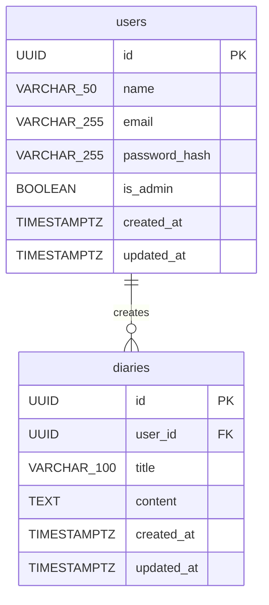

# DB Specification

## Database Platform

| Item | Rule |
| ---- | ---- |
| DBMS | PostgreSQL |
| Default schema | `public` |
| Character encoding | UTF-8 |
| Timestamp type | `TIMESTAMP WITH TIME ZONE` |
| Timestamp storage | UTC |
| Primary key format | UUID |
| UUID generation | `gen_random_uuid()` |
| Naming convention | `snake_case` |

## Schema Rules

- `contentPreview` is a derived API field and must not be stored in the
  database.
- Passwords must never be stored in plain text; only `password_hash` is
  persisted.
- `created_at` and `updated_at` are required on all persisted domain tables.
- `updated_at` must be updated on every successful row update.
- Diary deletion is a physical delete and deleted rows are not recoverable.

## Required Extension

```sql
CREATE EXTENSION IF NOT EXISTS pgcrypto;
```

## ER Diagram



## Rules Not Shown In The ER Diagram

- `users.email` must be unique.
- `users.name` must have a trimmed length between 1 and 50 characters.
- Only one administrator account can be created. Enforce this with a partial
  unique index on `is_admin = TRUE`.
- Raw passwords are validated before hashing at the API layer. Password length
  must be between 8 and 255 characters and include at least one letter and one
  number.
- `diaries.title` must have a trimmed length between 1 and 100 characters.
- `diaries.content` must have a trimmed length between 1 and 400 characters.
- `diaries.user_id` references `users.id` with `ON DELETE RESTRICT` and
  `ON UPDATE RESTRICT`.

## Indexes

| Index name | Table | Definition | Purpose |
| ---- | ---- | ---- | ---- |
| `users_email_key` | `users` | `UNIQUE (email)` | Authentication and uniqueness validation |
| `users_single_admin_uidx` | `users` | `UNIQUE (is_admin) WHERE is_admin = TRUE` | Enforce only one administrator account |
| `diaries_user_id_idx` | `diaries` | `(user_id)` | Lookup diary entries created by a user |
| `diaries_created_at_idx` | `diaries` | `(created_at DESC)` | Sort newest entries first and support date-based search |

## Query Rules

- Diary list queries order by `created_at DESC`.
- Date search should use a timestamp range query instead of wrapping
  `created_at` in a function.
- Recommended pattern:

```sql
WHERE created_at >= :date_start
  AND created_at < :next_date_start
```

- Pagination uses `LIMIT` and `OFFSET`.
