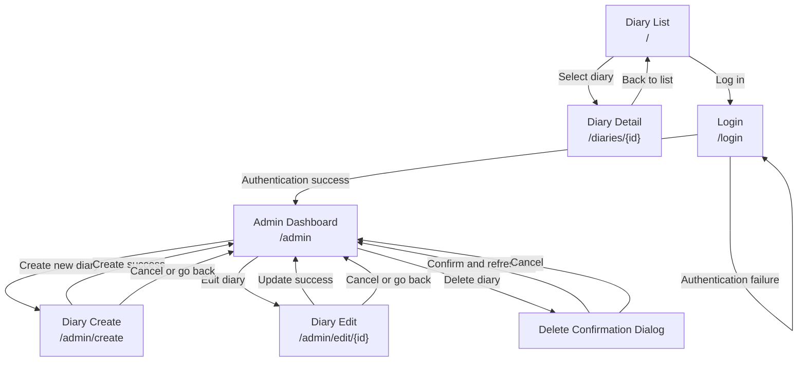

# UI Specification

## Design Direction

- The service name must be `つづる日記` in the Japanese locale and `Daybook` in the English locale.
- The visual design may be defined freely, using common diary services and modern web applications as references while prioritizing readability and a calm tone.
- The interface must prioritize diary readability over decorative presentation.
- The experience must remain consistent across desktop and mobile screens.

## Internationalization

- Supported locales are `ja` and `en`, with `ja` as the default locale.
- The frontend must use `next-intl` for internationalization.
- All visible copy, validation messages, empty states, error messages, and loading text must be translatable.
- The service logo is shared across locales, while the service name changes by locale.
- Dates must be formatted according to the active locale.
- Route paths are not translated by locale. For example, the diary creation screen always uses `/admin/create`.

## Screen Structure

| Screen | Route | Primary Actor | Purpose |
| ------ | ----- | ------------- | ------- |
| Diary List | `/` | Visitor, Administrator | Browse published diary entries |
| Diary Detail | `/diaries/{id}` | Visitor, Administrator | Read one diary entry |
| Login | `/login` | Administrator | Authenticate administrator access |
| Admin Dashboard | `/admin` | Administrator | Manage diary entries |
| Diary Create | `/admin/create` | Administrator | Create a diary entry |
| Diary Edit | `/admin/edit/{id}` | Administrator | Edit a diary entry |

## Screen Transition Diagram

## Shared Layout and Behavior

### Layout

- All screens use a shared header, main content area, and footer.
- The header displays the service logo, locale-specific service name, and a language switcher.
- Clicking the logo or service name navigates to the diary list.
- The footer displays `© kishimin 2026`.

### Loading

- During full-page loading states, show a full-page loading overlay with the service logo centered on the screen.
- For localized loading states such as list refetches or form submissions, do not block the entire page when a scoped loading indicator is sufficient.

### Feedback

- Validation errors must appear near the relevant field, with a form-level summary when needed.
- Submission errors that are not field-specific must use plain language and must not expose internal details.
- Success messages should be brief and disappear on the next page transition or after a short delay.
- Delete actions must use a reusable confirmation dialog.

### Shared Input Rules

- In the login form, email is required and must use a valid format, and password is required.
- In the diary editor form, title is required and must be 1 to 100 characters, and content is required and must be at least 1 character.
- The submit button for the active form must be disabled while submission is in progress.

## Component Design (Atomic Design)

### Atoms

- `LogoMark`
- `BrandText`
- `Button`
- `IconButton`
- `TextInput`
- `PasswordInput`
- `TextArea`
- `FieldLabel`
- `HelperText`
- `StatusMessage`
- `PaginationButton`

### Molecules

- `BrandBlock`
- `LocaleSwitcher`
- `SearchForm`
- `LabeledTextField`
- `LabeledTextArea`
- `DiaryMeta`
- `PaginationControls`
- `DialogActions`

### Organisms

- `GlobalHeader`
- `GlobalFooter`
- `DiaryListSection`
- `DiaryDetailSection`
- `LoginForm`
- `DiaryEditorForm`
- `AdminDiaryTable`
- `DeleteConfirmDialog`
- `FullPageLoadingOverlay`

### Templates

- `PublicPageTemplate`
- `AuthPageTemplate`
- `AdminPageTemplate`

### Pages

- `DiaryListPage`
- `DiaryDetailPage`
- `LoginPage`
- `AdminDashboardPage`
- `DiaryCreatePage`
- `DiaryEditPage`

## Screen Specifications

### 1. Diary List

#### Purpose

Show published diary entries and support date-based search.

#### Data Source

- `GET /api/diaries`

#### Main Sections

- `PublicPageTemplate`
- `SearchForm`
- `DiaryListSection`
- `PaginationControls`

#### Displayed Items

- Title
- `contentPreview`
- Created date
- Updated date

#### Interactions

- The user can choose a date and search.
- The user can clear the date and return to the default list.
- Selecting a diary item navigates to the diary detail page.
- Pagination changes the current results while preserving the active search condition.

#### States

- Initial state: newest diary entries are shown first.
- Loading state: use full-page loading on initial page load and a scoped loading state for list refetches.
- Empty state: show that no diary entries match the condition.
- Error state: show an error message and do not display the diary list or pagination.

### 2. Diary Detail

#### Purpose

Show the complete content of one diary entry.

#### Data Source

- `GET /api/diaries/{id}`

#### Main Sections

- `PublicPageTemplate`
- `DiaryDetailSection`

#### Displayed Items

- Title
- Created date
- Updated date
- Full content

#### Interactions

- The screen is reached from the diary list.
- If the diary entry does not exist, show a not-found message and a path back to the diary list.

#### States

- Loading state: show full-page loading.
- Not-found state
- Error state

### 3. Login

#### Purpose

Authenticate the administrator.

#### Data Source

- `POST /api/auth/login`

#### Main Sections

- `AuthPageTemplate`
- `LoginForm`

#### Displayed Items

- Email field
- Password field
- Login button

#### Interactions

- Submitting valid credentials redirects the administrator to the admin dashboard.
- Invalid credentials keep the user on the same screen and show a generic error message.

#### States

- Initial state
- Submitting state
- Error state

### 4. Admin Dashboard

#### Purpose

Provide diary management features for authenticated administrators.

#### Access Control

- Redirect unauthenticated users to `/login`.
- Do not expose admin navigation in the public browsing flow.

#### Data Source

- `GET /api/diaries`
- `DELETE /api/diaries/{id}`

#### Main Sections

- `AdminPageTemplate`
- Page title
- Create button
- `AdminDiaryTable`

#### Displayed Items

- Title
- Created date
- Updated date
- Edit button
- Delete button

#### Interactions

- The create button navigates to `/admin/create`.
- The edit button navigates to the diary edit page.
- The delete button opens a confirmation dialog.
- After successful deletion, refresh the list and show a success message.

#### States

- Loading state
- Empty state
- Error state: show an error message and do not display the management list.

### 5. Diary Create

#### Purpose

Allow an administrator to create a new diary entry.

#### Data Source

- `POST /api/diaries`

#### Main Sections

- `AdminPageTemplate`
- Page title
- `DiaryEditorForm`

#### Interactions

- On success, redirect to the admin dashboard.
- Disable the save button while submission is in progress.

#### States

- Initial state
- Submitting state
- Validation error state
- Error state

### 6. Diary Edit

#### Purpose

Allow an administrator to update an existing diary entry.

#### Data Source

- `GET /api/diaries/{id}`
- `PUT /api/diaries/{id}`

#### Main Sections

- `AdminPageTemplate`
- Page title
- `DiaryEditorForm` prefilled with the current values

#### Interactions

- On success, redirect to the admin dashboard.
- If the diary entry does not exist, show a not-found message instead of the form.
- Disable the update button while submission is in progress.

#### States

- Initial loading state
- Submitting state
- Not-found state
- Validation error state
- Error state

## Responsive Behavior

- On mobile, forms and list content stack vertically in a single column.
- Pagination must remain usable on narrow screens without horizontal scrolling.
- Diary content must preserve readable line length and spacing on both desktop and mobile.
- Buttons and input fields must remain large enough for touch interaction.

## a11y

- All interactive elements must be keyboard accessible.
- Inputs must have visible labels.
- Focus styles must remain visible on all screens.
- Error messages must be readable by assistive technologies.
- The delete confirmation dialog must trap focus while open.
